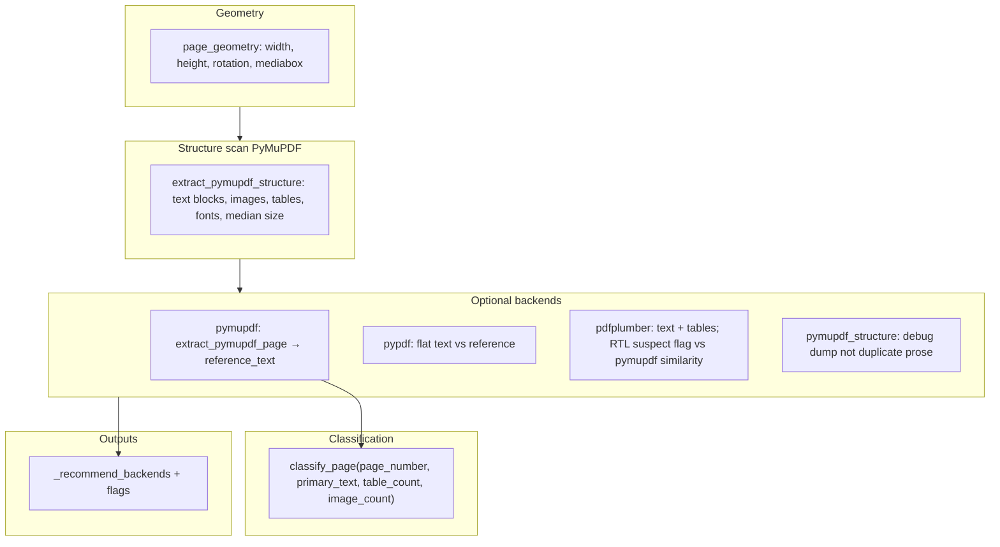
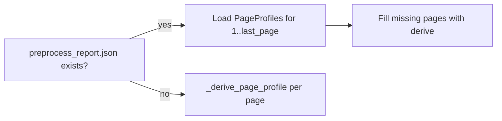
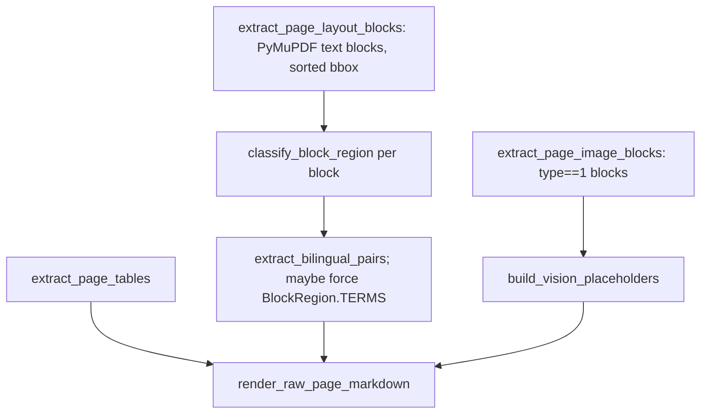
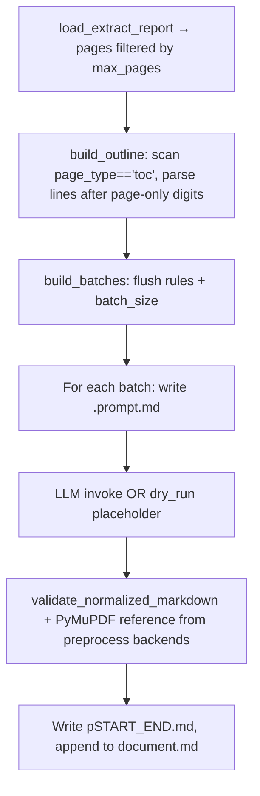
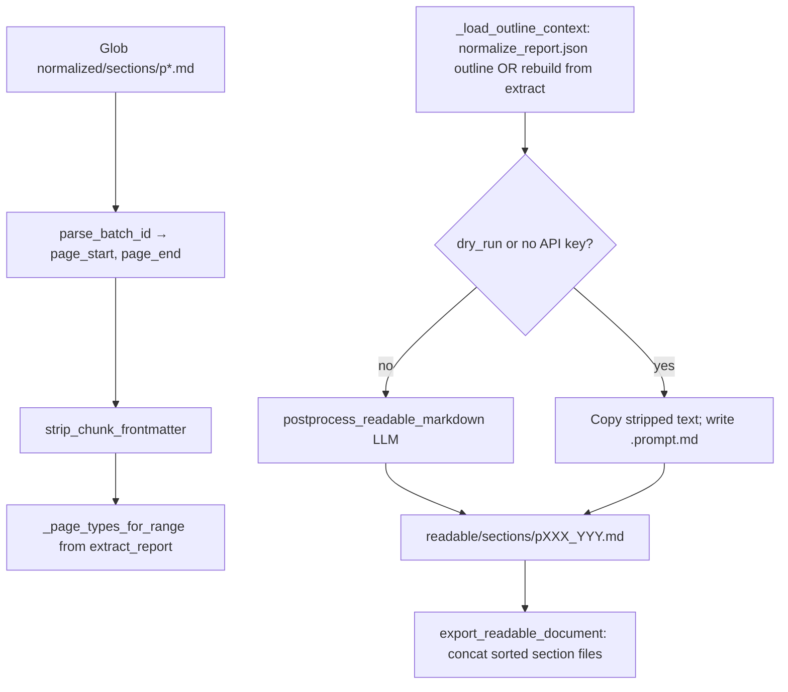
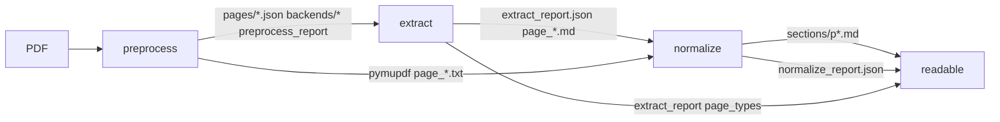

Below is a **code-level** walkthrough of each stage: what runs, in what order, what data structures move through the system, and where outputs land. Diagrams summarize the internals.

---

## Shared configuration (`IngestionConfig`)

Everything hangs off one config object (`pipeline/ingestion/config.py`):

- **`pdf_path`**, **`max_pages`**, **`output_dir`** → default `src/pipeline/assets/preprocess/`
- **`raw_markdown_dir`** → default sibling `assets/raw_markdown/` (parent of preprocess)
- **`normalized_markdown_dir`** → default `assets/normalized/`
- **Backend toggles**: `include_pymupdf`, `include_pdfplumber`, `include_pypdf`, `include_structure`, `include_docling`
- **Extract**: `extract_include_docling` (append full Docling markdown to the **concatenated** raw document only)
- **Normalize**: `normalize_batch_size`, `normalize_dry_run`

Extract and normalize **re-read** preprocess artifacts from disk (`preprocess_report.json`, `backends/pymupdf/page_*.txt`) rather than holding the full `PageProfile` in memory across processes.

---

## Stage 1 — Preprocess (`run_preprocessing`)

**Entry:** `pipeline/ingestion/preprocess/pipeline.py` → `run_preprocessing(config)`.

**Purpose:** For each page, build a **`PageProfile`**: geometry, layout statistics, multi-backend text samples, heuristic **page type**, flags, and a **ranked backend recommendation list** used later by extract (indirectly via stored JSON).

### Per-page pipeline (`_profile_page`)

**Details:**

1. **Geometry** — `page_geometry` opens the PDF with PyMuPDF and reads page rect / mediabox / rotation.

2. **Structure** — `extract_pymupdf_structure` runs `page.get_text("dict")`, splits **type 0** (text) vs non-text, counts **image-like** blocks, runs `page.find_tables()` when available, collects font names and span sizes, computes **median font size**.

3. **Primary text** — PyMuPDF full-page text (`extract_pymupdf_page`) is the default **reference** for other backends. It uses `_text_blocks`: blocks from `get_text("dict", sort=True)` filtered to text, then **re-sorted** with `_block_sort_key` `(y0, -x1)` for top-to-bottom, RTL-friendly reading order.

4. **Other backends** — Each wrapped in `_backend_extraction`: `analyze_text` → `TextSignals`, `quality_score` vs reference, optional **`rtl_penalty`** for pdfplumber when similarity to PyMuPDF is low (`pdfplumber_rtl_suspect` flag).

5. **Page type** — `classify_page` (`preprocess/classify.py`) scores **many** `PageType` enums from regex hits on raw + **normalized Arabic keywords** (`normalize_arabic_keywords`), plus layout hints (e.g. TOC + table, image-heavy lesson), plus **page-number priors** (page 1 → cover, 2–4 legal/TOC boost, 5 preface boost). Winner must beat **0.35** or page becomes `UNKNOWN`. Confidence is `best - 0.35 * second`.

6. **Flags** — `has_tables`, `has_images`, `replacement_chars_present` (from primary text signals).

7. **Recommendations** — `_recommend_backends` sorts successful backends by `quality_score`, then applies rules: prefer **pdfplumber first** when tables exist and RTL not suspect; demote pdfplumber when RTL suspect; prefer **pymupdf first** for `toc`, `lesson`, `inquiry`, `enrichment`.

8. **Persistence** — For each page: `pages/page_NNN.json` (full profile), and `backends/<backend>/page_NNN.txt` (header + extracted text for QC).

9. **Optional Docling** — If `include_docling`, runs `extract_docling_markdown` for pages `1..last_page`, writes `backends/docling/document.md`, path stored on report.

10. **Report** — `preprocess_report.json` + `preprocess_summary.md` + `backend_summary` aggregates.

---

## Stage 2 — Extract (`run_extraction`)

**Entry:** `pipeline/ingestion/extract/pipeline.py` → `run_extraction(config)`.

**Purpose:** Turn the PDF + **page profiles** into **`RawPageMarkdown`** per page: **layout blocks** (with semantic **region**), **tables**, optional **vision placeholders**, then a single **raw Markdown** string per page.

### Profile resolution (`load_preprocess.py`)

If preprocess was skipped, `_derive_page_profile` rebuilds geometry, structure, PyMuPDF text, `classify_page`, and sets **`recommended_backends` to `["pymupdf", "pymupdf_structure"]`** only (no full multi-backend comparison).

### Per-page extraction (`_extract_page`)

**Layout blocks** — `extract_page_layout_blocks` walks the same **sorted text blocks** as preprocess prose extraction; each block gets **lines** (joined spans), **bbox**, **max_font_size** from spans.

**Region assignment** — `classify_block_region` (`extract/regions.py`): vertical bands (header top ~11%, footer bottom ~10%); for lesson-like types, **x_center ≥ 54% page width → SIDEBAR**; else small font + few lines + lower page → **CAPTION**; special types map whole page to **FRONT_MATTER**; else **MAIN**.

**Bilingual / terms** — `extract_bilingual_pairs` finds Arabic–Latin pairs via `Arabic (Latin)` parentheses or `|` `/` `:` splits. If the page is **LESSON** or **GLOSSARY** and (sidebar or “many bilingual lines”), region is forced to **`TERMS`**.

**Tables** — `extract_page_tables`: first tries **PyMuPDF** `structure.tables`; if empty, **pdfplumber** rows. TOC pages can still end with empty tables (TOC path is mostly layout text).

**Vision placeholders** — `build_vision_placeholders`: **none** on cover/legal/toc/preface. Otherwise requires **`image_block_count >= 3`** in the **profile’s layout** (from preprocess). Then **every** `PageImageBlock` becomes `<!-- vision_ocr_pending: image=N bbox=... reason=... -->`. Reasons: `diagram_or_sidebar_layout` for lesson/inquiry/enrichment, `text_layer_degraded` if replacement chars flag, else `layout_heavy_page`.

**Markdown assembly** — `render_raw_page_markdown`: YAML mini-header (`page`, `page_type`, `recommended_backends`, `flags`), HTML comments, then each block as `<!-- block: N region=... bbox=... -->` + optional bilingual list + lines; then markdown tables; then vision comments; then extraction notes.

**Document-level** — Concatenates all `page.markdown`. If `extract_include_docling`, appends a Docling appendix section (separate from per-page files).

**Report** — `extract_report.json` lists all `RawPageMarkdown` payloads (including full `markdown` for each page).

---

## Stage 3 — Normalize (`run_normalization`)

**Entry:** `pipeline/ingestion/normalize/pipeline.py` → `run_normalization(...)`.

**Purpose:** Batch raw pages → **LLM** → **schema Markdown** (many YAML chunks per batch), **validate**, write **section files** + **QC JSON** + **normalize_report.json**. Does **not** write readable output (that is stage 4).

### Outline and batches

**Outline (`toc.py` → `build_outline`)** — Book title from **cover page 1** if it contains “العلوم”. For each **`page_type == "toc"`** page, `_parse_toc_page` walks **block lines** in order: a line that is **only 1–3 digits** starts a new TOC entry (page number); following non-numeric lines accumulate into the **title** until the next page number. `_infer_entry_kind` labels unit/lesson/enrichment/inquiry/review/preface from Arabic keywords. Then a second pass assigns **`unit_no` / `lesson_no`** counters walking entries in order (units increment `unit_no` and reset lesson counter; lessons get sequential `lesson_no` within current unit).

**Batching (`batching.py` → `build_batches`)** — Pages sorted by number. **`cover`, `legal`, `preface`, `toc`**: each page is **its own batch** (flush before/after). Other pages: batch key is `(page_type, page_num, page_num)` so **same type and contiguous pages** can merge up to **`normalize_batch_size`**. Note: **`unknown`** is **not** in the single-page flush list, so unknown pages batch like normal lesson-like pages.

**Prompt** — `build_user_prompt`: `MARKDOWN_SCHEMA_GUIDE` + `guidance_for_page_types` (fidelity + cover/legal/preface/toc vs general) + **`render_outline_context`** (same string for every batch in the run) + raw concatenated markdown for the page range.

**LLM** — `normalize_batch_markdown`: `SystemMessage` + `HumanMessage`, temperature **0** in `run_normalization`; strips optional markdown code fences from the reply.

**Dry-run** — If `dry_run` **or** provider has no API keys (`provider_is_configured`), writes a **single placeholder chunk** per batch with `<!-- normalization_pending: dry_run -->`.

**Validation (`validate.py`)** — Parses **every** `--- ... ---` chunk: required YAML keys from `schema.REQUIRED_FRONTMATTER_FIELDS`, valid `content_kind`, heading levels warn if not only `#`–`###`, warns on leftover `vision_ocr_pending`, footnote ref/def mismatch, counts figures and page_break comments. If **`preprocess/.../backends/pymupdf/page_NNN.txt`** exists, `load_reference_text` strips header lines and **`SequenceMatcher.ratio`** between reference and **full normalized markdown** → `reference_similarity` and `approx_cer` (coarse signal, not true CER).

**Outputs** — Per batch: `sections/{batch_id}.prompt.md`, `sections/{batch_id}.md`; `normalized/document.md`; `qc_report.json`; `normalize_report.json` (includes full outline + sections metadata).

---

## Stage 4 — Readable export (`run_readable_export`)

**Entry:** `pipeline/ingestion/normalize/readable_pipeline.py`.

**Purpose:** Take **normalized section files** (`p*.md`, not `*.prompt.md`), strip **per-chunk YAML**, optionally **LLM-postprocess** for reading order, write **`readable/sections/`** and merge **`readable/document.md`**.

### Flow

**Outline for readable** — Prefer **`normalize_report.json`** outline entries if present; else rebuild `build_outline` from extract report (respecting `max_pages` on extract pages when rebuilding).

**Dry-run** — Writes `readable/sections/{batch_id}.prompt.md` with `READABLE_LAYOUT_GUIDE` + same `page_guides` as normalize + stripped markdown; section `.md` is **unmodified** stripped text.

**Live** — Second LLM call per section (`readable_postprocess.py`): same provider factory as normalize, temperature **0**; prompts stress **no YAML**, **book reading order**, headings, TOC as table, figure block shape, no invention.

**Merge** — `export_readable_document` reads **readable/sections** sorted glob order (so `p001_001` before `p010_010`), joins with blank lines.

---

## How the four stages depend on each other

---

## Mental model

| Stage | Computes | Stores “truth” for next stage |
|--------|------------|--------------------------------|
| **Preprocess** | Page type, layout stats, backend quality | JSON profiles + backend text files |
| **Extract** | Spatial blocks + tables + vision hints | Per-page raw MD + extract_report |
| **Normalize** | Schema chunks + LLM cleanup + QC metrics | Section MD with YAML + reports |
| **Readable** | Human-oriented layout (second LLM pass) | No YAML; merged reader doc |

If you want one more diagram (e.g. **only** the `classify_page` score matrix or **only** TOC line state machine), say which piece to zoom in on.